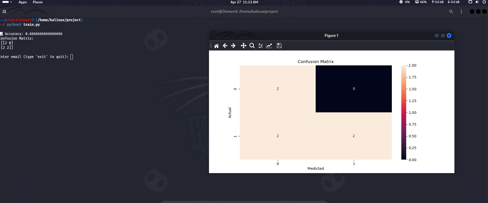

# 🔐 Phishing Email Detection Model

## 📌 Overview
This project uses Machine Learning to detect phishing emails.

It classifies emails into:
- ⚠️ Phishing
- ✅ Safe

---

## 🚀 Features
- TF-IDF text processing
- Logistic Regression model
- Accuracy evaluation
- Confusion matrix visualization
- Live email testing

---

## 🛠️ Tech Stack
- Python
- Scikit-learn
- Pandas
- Matplotlib
- Seaborn

---

## 📊 Example Output


---


---

## ▶️ Run Project

```bash
pip install pandas scikit-learn matplotlib seaborn
python3 phishing_model.py
```


